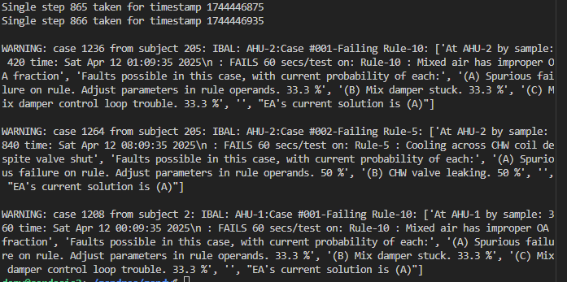

# Instructions for Running a ZandrEA Demo
## What you'll need
This instruction presumes the reader is using a computing environment similar to the following:
- A PC meeting at least the requirements listed in README.md
- A native Linux OS, or Microsoft Windows 10 or 11 that is utilizing WSL2 with a Linux distro. Ubuntu 20.04 LTS was used to develop ZandrEA source code and the demo.
- Git and Docker installed into the Linux distro. If Win10/11 with WSL2 is used, that further requires Docker Desktop being installed in the Windows space with settings to work through WSL2.
- GNU Make, JavaScript, Python, a C++ compiler, and a web browser installed as discussed in README.md
- A development environment comparable to Microsoft VS Code with the appropriate extensions (i.e., at least Git, Docker, and the Remote Extension allowing a Windows install of VS Code to work through WSL).
## First, follow these steps:
1. Create a root directory for your local repo, and clone ZandrEA into it. Local ZandrEA components built in the next step from your repo (e.g., its volume) will be identified by your root directory's name.
1. Build your local repo.  Normally, this means running 'make docker-up' with your terminal active in the root directory, where 'docker-up' is a target within the base Makefile. This should result in the four ZandrEA containers (noted in README.md) being started. Also, there will be a volume ZandrEA creates for its knowlege base (KB). The 'ea-bacnet' container will appear to run only intermittently.  That is expected.
1. Open your browser's 'localhost' to pull up the EA GUI.
- Recall from README.md that "EA" simply refers to the core part of ZandrEA doing basic AFDD surveillance and diagnostics. The top area of the GUI will show a pull-down box labeled "EA FDD Console for: IBAL".
- "IBAL" refers to the Intelligent Building Agents Laboratory, a physical laboratory at NIST for advanced HVAC controls and AFDD research, as discussed in Section 1.0 of the ZandrEA primer (link in README.md).
- Clicking for  "Subjects" in the pull-down will list the pieces of IBAL equipment included for AFDD surveilance in the current demo. Because no building automation system (BAS) data has yet run through the surveillance, the GUI shows little else. However, its connection to the ZandrEA container driving it should be confirmed by a green double-arrow, seen to the right of the bell-shaped icon used to access an "alerts queue".
## Next, run BAS data through your ZandrEA instance:
1. Note the location of data files in .csv format at [repo root]/EAd/tests/testdata. The file used here will be 'ibal_p3a11v11_gt0_250224.csv'. It contains approximately 14 hours of data sampled from the two AHU and four VAV boxes in the IBAL, at 60 seconds per sample.
1. With a terminal active at your repo root directory, call the Python script that runs tests and demos on data files as follows:  
python3 ./EAd/tests/ead-push-date-time-ahu-vav-from-csv.py -t now -s 60 ./EAd/tests/testdata/ibal_p3a11v11_gt0_250224.csv  
1. The Python script will drive the data through EA at much faster than real time, quickly ending up with a report to the terminal similar to:  
   
Of the three Cases generated above, only one reflects an actual fault present in the IBAL.  The Case of data failing AHU Rule-5 on AHU-2 reflects an actual leaky control valve in the IBAL. The other two Cases, both on AHU Rule-10, are spurious.  They reflect that the Rule itself requires further development.

## Reopen localhost in the browser to see the AFDD results at the GUI:
Opening localhost with the browser again will show the GUI after the demo is run.  Refer to Section 6.4 of the ZandrEA primer for guidance on naviagting the GUI. Basically, you can:
-  Click on any of the equipment in the "Subjects" list to pull up its dedicated GUI. Note that what is shown represents the state of the AFDD surveillance at the time of the last sample in the data file.
- Once a Subject's GUI is pulled up, you can click further to open any "Case" that Subject generated during the data run.  The question and answer format of the EA expert system diagnostic process (Section 7.0 in the primer) will function, and probabilities of root causes ("Hypotheses") are recalculated as you answer "Evidence Item" queries. Also accessible is The time-series ("Krono") snapshot of the AFD context as each Case was generated.
- Other features of the GUI can be explored, such as "Kronos" (time-series of Rule results, Fact claims, and raw data). "Rule Kits", "Histograms", and "Knobs" (all discussed in the primer) also can be accessed. Recall, though, everything shown at this point reflects only the AFDD state at the last sample round.

## Having it work slowly enough to see what is happening as it happens, but not to work too slowly:
The results of the previous demo can be cleared best by stopping the current containers and starting new ones:
1. Run 'make docker-down'.  When that is complete, again run 'make docker-up'
1. Run the Python script with an additional flag to slow its stepping through the rows of the .csv file:  
python3 ./EAd/tests/ead-push-date-time-ahu-vav-from-csv.py -i 1 -t now -s 60 ./EAd/tests/testdata/ibal_p3a11v11_gt0_250224.csv  
The added flag and value ' -i 1' after the filename slows execution to one second per file row.  This is slow enough to go to the browser GUI and see AFDD states transpire as data passes.  It is not so slow, however, as a run made at the real-time rate.  More about the Python "data driving" script can be found by calling its help feature from the terminal command line.