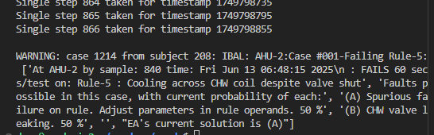

# Instructions for Running the ZandrEA Demo
## What you'll need
Your computing environment needs to include the following:
1) Computing hardware meeting at least the requirements listed in README.md
2) A native Linux OS, or Microsoft Windows 10 or 11 that is utilizing WSL2 with a Linux distro. Ubuntu 20.04 LTS was used to develop ZandrEA source code and the demo.
3) Git and Docker installed into the Linux distro. If Windows 10/11 with WSL2 is used, that further requires Docker Desktop being installed in the Windows space with settings to work through WSL2.
4) GNU Make, JavaScript, Python, a C++ compiler, and a web browser installed as discussed in README.md
5) A development environment comparable to having Microsoft VS Code with the appropriate extensions (i.e., at least Git, Docker, and the Remote Extension allowing a Windows install of VS Code to work through WSL).

## A1. To simply run a demo and interact with it, begin with this step:
1) Create a root directory for a local repository (“repo”), and `clone` ZandrEA directly into it. Local ZandrEA components built from your local repo (e.g., its volume) will be identified by your root directory's name.

## A2. To be also ready to collaborate in ZandrEA development, begin with these steps (additionally requires a GitHub account):
1)	Inside your own account on GitHub.com, create a development fork (“dev fork”) of the `main` branch of ZandrEA (i.e., the "Project Site").
2) On your local computer, set up a local development environment (LDE) meeting the requirements in "What you'll need", above. Set your dev fork repo as your LDE's `origin`.
3)	`Clone` the `origin` back into your LDE to create the local repo, and set the Project Site as the `upstream` repo to your local repo.
4) You will add or delete other branches to your local repo and `origin`as you see fit (instead of using your `main` branches) for local code development and for generating Pull Requests (“PRs”) sent to Project Site.  Updates to the `main` branch at your `origin` should be made only by pushes from the local repo `main` branch, typically after that branch has been updated by a pull from the `main` branch at the `upstream` repo.
5) Make timely pulls to your local repo `main` of updates that NIST or other commiters are making to the `upstream` Project Site, noting this sets aside your local `main` as an ongoing reference to work committed by others.

## B. Once you have a local repo, do the following:

1. Build a local instance of ZandrEA from your repo by a command line interface (CLI) call of `make docker-up` at a terminal active in the root directory. The argument `docker-up` is a target within the root Makefile.
   - This should result in the four ZandrEA containers (noted in README.md) being started. The `ea-bacnet` container will appear to run only intermittently.  That is expected because there is currently no real-time BACnet data resource communicating with it.
   - Also, there will be a volume ZandrEA creates for its knowlege base (KB).
1. Open your browser's `localhost` to pull up the EA GUI.
   - Recall from README.md that "EA" simply refers to the core part of ZandrEA. The top area of the GUI will show a pull-down box labeled "EA FDD Console for: IBAL".
   - "IBAL" refers to the Intelligent Building Agents Laboratory, a physical laboratory at NIST for conducting research in HVAC controls and AFDD (see Sect. 1.0 of the ZandrEA primer).
1. Clicking for  "Subjects" in the pull-down will list the equipment pieces in the IBAL equipment that the demo has under AFDD surveilance. Because no building automation system (BAS) data has yet run through this surveillance, the GUI shows little else. However, its connection to the ZandrEA container driving it is confirmed by a green double-arrow, seen to the right of the bell-shaped icon used to access an "alerts queue".
## C. Next, run a file containing IBAL data through your ZandrEA instance:
1. Note the location of data files in .csv format at `[repo root]/EAd/tests/testdata/`. The file used there will be `ibal_demo_250224.csv`. It contains approximately 14 hours of data sampled from two AHU and four VAV boxes in the IBAL, at 60 seconds per sample.
1. With a terminal active at your repo root directory, call the Python script that runs tests and demos on data files as follows:<br><br>
```python3 ./EAd/tests/ead-push-date-time-ahu-vav-from-csv.py -t now -s 60 ./EAd/tests/testdata/ibal_demo_250224.csv```<br><br>
1. The Python script will drive the data through EA at much faster than real time, quickly ending up with a report to the terminal similar to:<br><br>
<br>  
The fault Case identified, of data failing AHU Rule-5 on AHU-2, reflects an actual leaky control valve in AHU-2 of the IBAL.  However, that solution (i.e., identifying the cause of a fault) of the Case is not known to ZandrEA yet, because the User (you) have not yet exercised the diagnostic EA expert system. Section 3.0 in the ZandrEA primer describes the expert system and how the probabilities it reported here came about.

## D. Reopen localhost to browse through AFDD results in the GUI:
Opening localhost with the browser again will show the GUI after the demo is run.  Refer to Section 6.4 of the ZandrEA primer for guidance on naviagting the GUI. Basically, you can:
-  Click on any of the equipment in the "Subjects" list to pull up its dedicated GUI. Note that what is shown represents the state of the AFDD surveillance at the time of the last sample in the data file.
- Once a Subject's GUI is pulled up, you can click further to open any "Case" that Subject generated during the data run.  The question and answer format of the EA expert system diagnostic process (Section 7.0 in the primer) will function, and probabilities of root causes ("Hypotheses") are recalculated as you answer "Evidence Item" queries. Also accessible is The time-series ("Krono") snapshot of the AFD context as each Case was generated.
- Other features of the GUI can be explored, such as "Kronos" (time-series of Rule results, Fact claims, and raw data). "Rule Kits", "Histograms", and "Knobs" (all discussed in the primer) also can be accessed. Recall, though, everything shown at this point reflects only the AFDD state at the last sample round.

## E. Running the demo run slowly enough to see what is happening as it happens, but to still run faster than real time:
The results of the previous demo run are now cleared out by stopping the current containers and restarting on new ones:
1. Run `make docker-down`.  When that is complete, again run `make docker-up`
1. Run the Python script with an additional flag to slow its stepping through the rows of the .csv file:<br><br>
```python3 ./EAd/tests/ead-push-date-time-ahu-vav-from-csv.py -i 1 -t now -s 60 ./EAd/tests/testdata/ibal_demo_250224.csv```<br><br>
The added flag and value ` -i 1` after the filename slows execution to one second per file row.
1. Go to the browser GUI and see AFDD states proceeding in time as data passes. The various GUI elements still function as was seen before. This is not as slow, however, as a run made at the real-time rate, which would occur for ` -i 60`.  Other features of the Python "data driving" script can be found by calling its help feature from the terminal command line.

## F. Supplementary notes regarding the demo

1. Upon the call to `make docker-up`, the following applies:
   - The token `docker-up` is not a command, but a target within the root directory `Makefile`, which leads to further Make, Docker, and Docker Compose files that are not all in the root directory.
   - All the AFDD surveillance objects that will exist in the C++ back-end of the ZandrEA application are instantiated at this point. This means each of the AFDD Tool objects; that is, one each of the AHU AFDD Tool for IBAL AHU-1 and AHU-2, and one each of the VAV unit AFDD Tool for units VAV-1 through VAV-4.
   - Each AFDD Tool object itself instantiates many further objects: Point objects, Chart objects, Fact objects, Rule objects, and others.  That process is discussed in more detail in Section 5.0 of the ZandrEA primer (NIST TN-2337).
   - The above all happens because, *currently*, part of starting up the ea_rest container involves executing the hard-coded constructor of the class `CApplication`, seen (approximately) at Lines 2529 through 2638 of file `[root]/libEA/tool.cpp`.
   - Future work on ZandrEA will replace the above hard-coded configuration action with automation based upon runtime information. A future ZandrEA source code contribution will automatically interact with an ASHRAE 223P-compliant resource holding configuration information and data from  the particular building addressed. In the ZandrEA primer, the action this future code will perform is called "automated building information discovery" (ABID).
   - The future source code component performing ABID will generate a "surveillance information file" (SIF) that concentrates information from the ASHRAE 223P-compliant resource into that relevant to automatically configuring a ZandrEA instance to the particular building.
   - The hardcoded `CApplication` class will be amended or replaced by new source code components, which here are collectively called "Future Code A".  Future Code A will read a SIF in order to compose and make calls upon AFDD Tool object constructors, yielding the same effect that the hardcoded `CApplication` class does. Its advantage will be that configurating of AFDD Tool objects in the instance will be based on information read from the SIF at runtime (i.e., application startup). That vastly enhances the scalability and extensibility of ZandrEA beyond what is feasible under a hardcoded `CApplication` class.
1. Upon the call to run CSV file data through the ZandrEA instance, the following applies:
   - The call is to Python 3 routine `ead-push-date-time-ahu-vav-from-csv.py` located at `[root]/EAd/tests/`, and is referred to in general here as the current "data driving routine".
   - Inspection of the current data driving routine reveals that it uses hardcode to associate values in specific columns of the CSV file to data quantities (i.e., BAS points) needed by the AFDD Tool objects discussed in (1) above. The problem in that is appreciated by opening data file `ibal_demo_250224.csv` in a csv-aware viewing application. For example, columns 4 through 14 hold point data for AHU-2. Further, within that 11-column block, the text column names in the top row specifically identify Column 8 as being `A2_Tar`, the return air temperature for AHU-2. However, ZandrEA presently has no source code component able to read a resource, and then generate that association (also called a "mapping") as an automated configuration step in support of the data driving routine.  Instead, at present that configuration is predefined in hardcode written by the human author of the current data driving routine, as evident from lines 12 through 39 of `ead-push-date-time-ahu-vav-from-csv.py`.
   - Another future source code component, "Future Code B", will read a SIF and then generate mappings that pass values from columns in any suitably-formatted CSV file into calls upon the appropriate methods of the ZandrEA "Runtime API".  The Runtime API is described in Section 6.0 of the ZandrEA primer. The relevant part of the API is seen in the primer's Listing 29 and also in file `[root]/libEA/exportCalls.hpp` of a ZandrEA repo.
   - Passing data values from a CSV file into the ZandrEA back end requires Future Code B making repeated calls to Runtime API method `SetCoincidentInputsForSubject()`.  That method, in turn, requires Future Code B to compose vector arguments carrying sample data values, with those compositions being based on information Future Code B obtains using other Runtime API methods.
   - ZandrEA project goals place work on Future Code B at a higher priority than work on Future Code A, even though Future Code A would (normally) generate the SIF read by Future Code B.   That is because automating configuration of the CSV file-to-API data driving process is a more pressing scalability issue for ZandrEA than is automating the instantiation of objects present in an application instance.  Thus, a human-intelligible format for all SIF will be developed first, and then development of Future Code B will proceed using SIF examples composed by human staff based on equipment in the IBAL.

